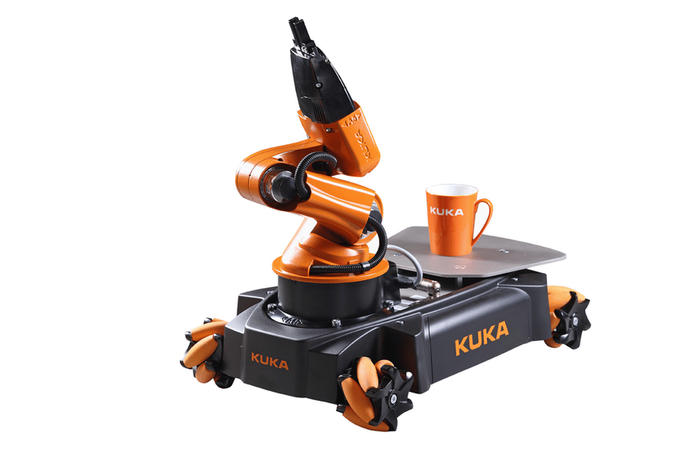
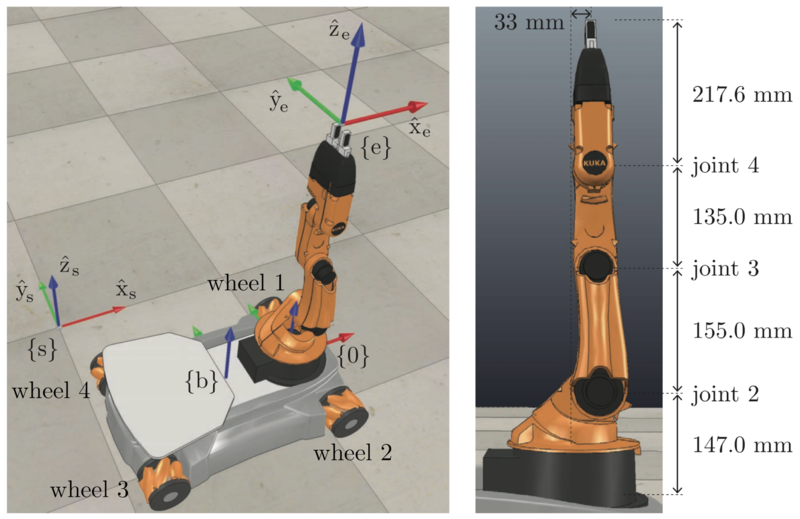
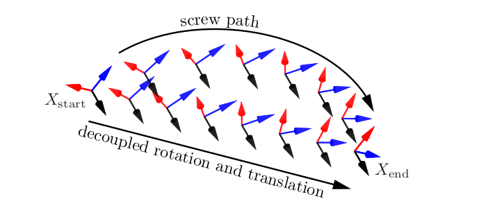
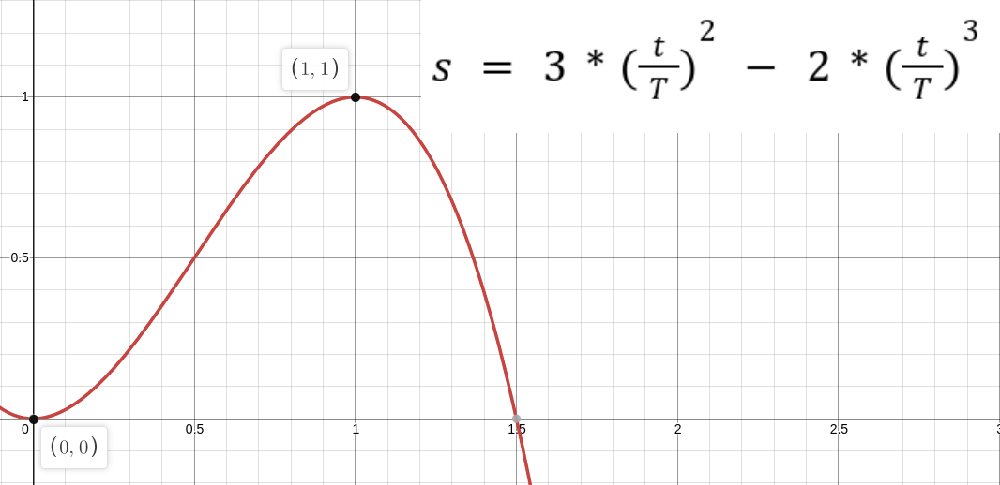
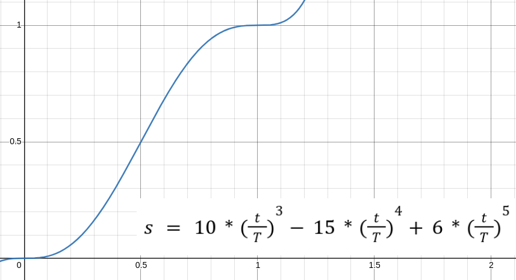
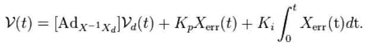
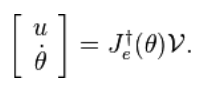
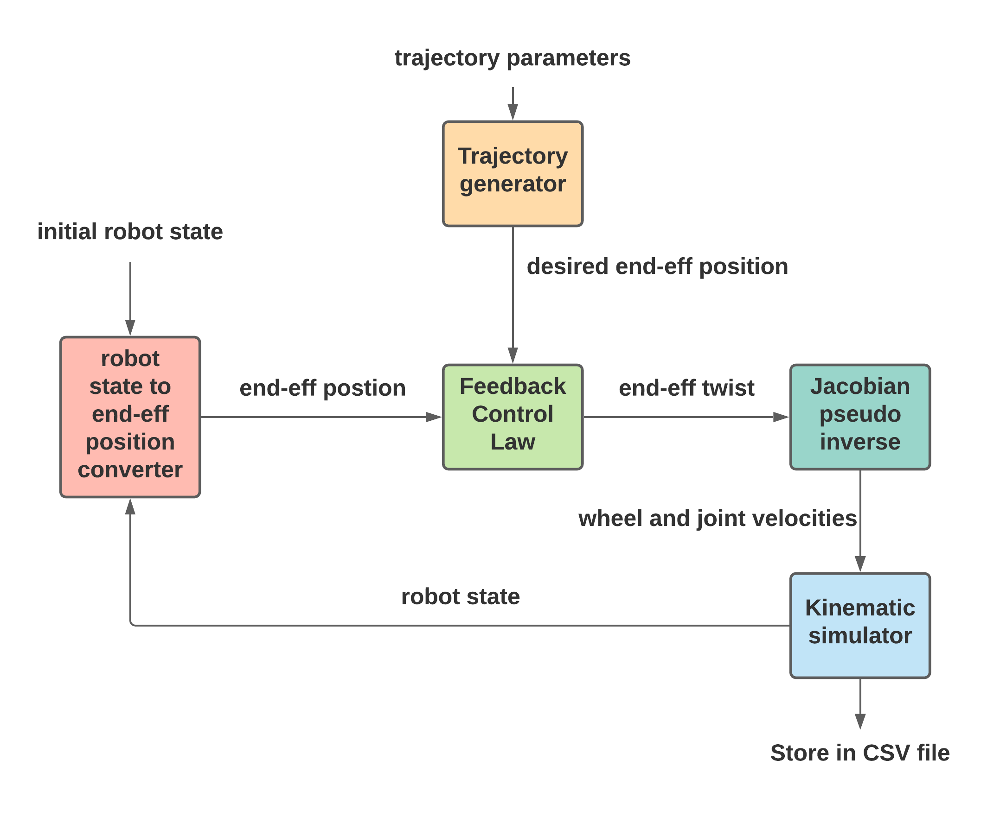

# Modern-Robotics-Capstone-Project

## Introduction
The capstone project of the [Modern Robotics: Mechanics, Planning, and Control Specialization](https://www.coursera.org/specializations/modernrobotics) involves several concepts from robotics put together to create a kinematic simulation of a mobile manipulator.

The robot to be kinematically simulated is the [Kuka YouBot](https://cyberbotics.com/doc/guide/youbot). 
<p align="center">
  
</p>
<p align="center">
    Fig: Kuka YouBot
</p>

This Robot has to perform a pick place operation where in the object to be moved is a cube of side 50mm. The entire operation has to be kinematically simulated by the program and a final CSV file of the timestamped robot states has to be generated for visualization in [CoppeliaSim](https://www.coppeliarobotics.com/). The scene for visualization can be found [here](./coppeliaSim).

<p align="center">
  
</p>
<p align="center">
    Fig: Kuka YouBot Visualised in coppeliaSim
</p>

## List of Software
- MATLAB
- coppeliaSim

## Milestones
The Project is divided into 3 milestones for simplicity.

1. [Kinematic Simulator](#kinematic-simulator)
2. [End-Effector Trajectory Generator](#end-effector-trajectory-generator)
3. [Feedforward + PI Controller](#feedforward-+-pi-controller)

## Kinematic Simulator
The objective of this milestone is to write a program ```NextState.m```. This program calculates the resultant robot configuration if a given configuration is subjected to a given velocity vector. It does so by integrating the velocity vector over the given time interval. 

The robot configuration at any point of time is represented by the 13-vector:

```
chassis phi, chassis x, chassis y, J1, J2, J3, J4, J5, W1, W2, W3, W4, gripper state
```

The velocity Vector is likewise represented as:
```
js1, js2, js3, js4, js5, ws1, ws2 ws3 ws4
```
where: js1 is joint 1 velocity, ws1 is wheel 1 velocity. 

## End-Effector Trajectory Generator
The end-effector trajectory is a series of transforms in the world/space frame that represent the desired position for the end effector at each timestep. This is generated by the function ```TrajectoryGenerator.m```.

There are two methods of producing the required trajectory.
<p align="center">
  
</p>
<p align="center">
    Fig: Screw and cartesian trajectories
</p>

1. [Screw Trajectory](#screw-trajectory)
2. [Cartesian Trajectory](#cartesian-trajectory)

And two methods of time scaling the trajectory.

1. [Cubic Scaling](#cubic-scaling)
2. [Quintic Scaling](#quintic-scaling)

### Screw Trajectory
The motion of the end-effector through space is a continous screw motion from  start to finish.
<p align="center">
  
</p>

### Cartesian Trajectory
The motion of end-effector is a separate into a simultaneous rotation and straight line translation.
<p align="center">
  
</p>

### Cubic Scaling
The trajectory's progression through time is represented by a cubic polynomial.
<p align="center">
  
</p>
<p align="center">
    s = 0 at start. s = 1 at end. T = total time of motion
</p>

### Quintic Scaling
The trajectory's progression through time is represented by a quintic polynomial.
<p align="center">
  
</p>
<p align="center">
    s = 0 at start. s = 1 at end. T = total time of motion
</p>

The trajectory is outputed in a matrix where each row represents a transformation matrix along with the gripper state (whether closed or open):
```
r11, r12, r13, r21, r22, r23, r31, r32, r33, px, py, pz, gripper_state
```

## Feedforward + PI Controller
The purpose of this milestone is to write code to calculate the velocity vector which when applied to the robot configuration over the given time interval will minimize the error between the desired end-effector position and the actual end-effector position at the current timestamp.

This controller will use the control law:
<p align="center">
  
</p>
<p align="center">
    Fig: feedforward + PI control
</p>

This equation will output the required end-effector twist that will take the end-effector to the desired position in the given time interval. It is implemented in the program ```FeedbackControl.m```.

The twist has to be converted to the velocity vector by using a Jacobian pseudo inverse. This calculation is given by the equation:

<p align="center">
  
</p>
<p align="center">
    Fig: Calculate wheel and joint speeds.
</p>

This is implemented in the program ```end_eff_twist_to_joint_wheel_velocities.m```. 

## Assembly 
The various described components will be combined to form the final program. The overall flow of the program is described in the chart given below.

<p align="center">
  
</p>
<p align="center">
    Fig: Program flow
</p>

## Final Output

<p align="center">
  
</p>
